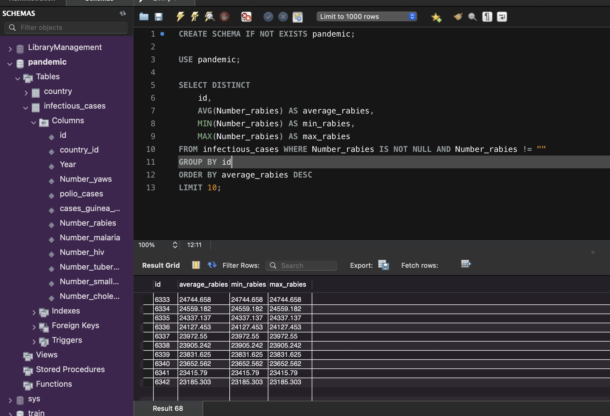

# Покрокова інструкція виконання фінального проєкту

## Результат виконаного ДЗ

1. Завантажте дані:

- Створіть схему pandemic у базі даних за допомогою SQL-команди.
- Оберіть її як схему за замовчуванням за допомогою SQL-команди.
- Імпортуйте [**дані**](https://drive.google.com/file/d/1lHEXJvu2omYRgvSek6mHq-iQ3RmGAQ7e/view) за допомогою Import wizard так, як ви вже робили це у темі 3.
  [**infectious_cases.csv**](https://prod-files-secure.s3.us-west-2.amazonaws.com/89fec302-e51c-45d8-a968-db8bdab456d2/74d1694c-7c06-403a-b8fa-301608033701/infectious_cases.csv)
- Продивіться дані, щоб бути у контексті.

```js
CREATE SCHEMA IF NOT EXISTS pandemic;

USE pandemic;
```


2. Нормалізуйте таблицю infectious_cases. Збережіть у цій же схемі дві таблиці з нормалізованими даними.
```js
CREATE SCHEMA IF NOT EXISTS pandemic;

USE pandemic;

SET SQL_SAFE_UPDATES = 0;


CREATE TABLE IF NOT EXISTS country(
	id INT PRIMARY KEY auto_increment,
	name VARCHAR(32) NOT NULL UNIQUE,
	code VARCHAR(8) UNIQUE
);

INSERT INTO country(name, code)
SELECT DISTINCT entity, code FROM infectious_cases;

ALTER TABLE infectious_cases
ADD COLUMN id INT PRIMARY KEY auto_increment FIRST,
ADD COLUMN country_id INT AFTER id,
ADD CONSTRAINT fk_country_id FOREIGN KEY (country_id) REFERENCES country (id);

UPDATE infectious_cases ic SET country_id = (SELECT id FROM country c WHERE ic.code = c.code);

ALTER TABLE infectious_cases
DROP COLUMN entity,
DROP COLUMN code;

SELECT * FROM infectious_cases ORDER BY country_id;

```


3. Проаналізуйте дані:

- Для кожної унікальної комбінації Entity та Code або їх id порахуйте середнє, мінімальне, максимальне значення та суму для атрибута Number_rabies. Результат відсортуйте за порахованим середнім значенням у порядку спадання.
- Оберіть тільки 10 рядків для виведення на екран.
```js
CREATE SCHEMA IF NOT EXISTS pandemic;

USE pandemic;

SELECT DISTINCT
	id,
	AVG(Number_rabies) AS average_rabies, 
	MIN(Number_rabies) AS min_rabies, 
	MAX(Number_rabies) AS max_rabies,
    SUM(Number_rabies) AS sum_rabies
FROM infectious_cases WHERE Number_rabies IS NOT NULL AND Number_rabies != ""
GROUP BY id
ORDER BY average_rabies DESC
LIMIT 10;
```


4. Побудуйте колонку різниці в роках.

Для оригінальної або нормованої таблиці для колонки Year побудуйте з використанням вбудованих SQL-функцій:

- атрибут, що створює дату першого січня відповідного року,
- атрибут, що дорівнює поточній даті,
- атрибут, що дорівнює різниці в роках двох вищезгаданих колонок.

```js
CREATE SCHEMA IF NOT EXISTS pandemic;

USE pandemic;

SELECT id, year, 
MAKEDATE(year, 1) AS year_date,
CURDATE() AS cur_date,
DATEDIFF(CURDATE(), MAKEDATE(year, 1)) AS days_pass 
FROM infectious_cases;
```


5. Побудуйте власну функцію.

- Створіть і використайте функцію, що будує такий же атрибут, як і в попередньому завданні: функція має приймати на вхід значення року, а повертати різницю в роках між поточною датою та датою, створеною з атрибута року (1996 рік → ‘1996-01-01’).
```js
CREATE SCHEMA IF NOT EXISTS pandemic;

USE pandemic;

DROP FUNCTION IF EXISTS DAYSPASS;

DELIMITER //

CREATE FUNCTION DAYSPASS(year_in YEAR)
RETURNS INT
DETERMINISTIC 
NO SQL
BEGIN
    DECLARE result INT;
    SET result = DATEDIFF(CURDATE(), MAKEDATE(year_in, 1));
    RETURN result;
END //

DELIMITER ;

SELECT id, year, 
DAYSPASS(year) AS days_pass 
FROM infectious_cases;    
```
